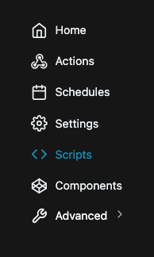
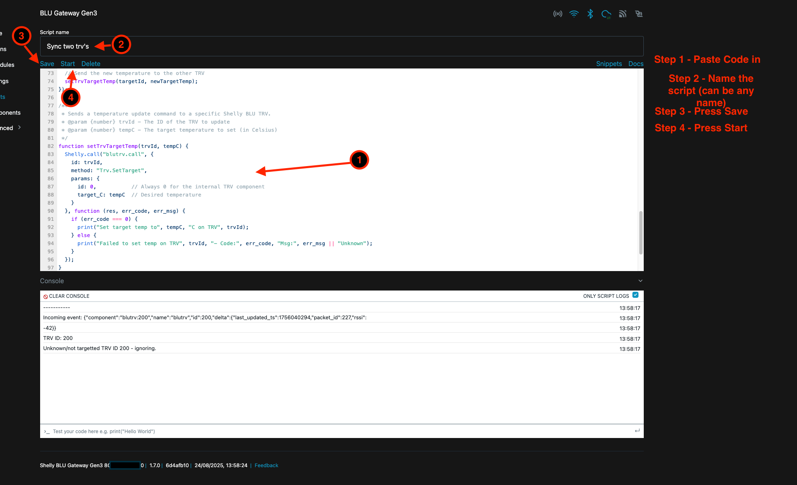
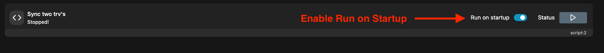

# Shelly-TRV-Sync

A Shelly script to synchronize multiple TRV (Thermostatic Radiator Valve) devices, ensuring they maintain the same target temperature settings.

## Introduction

This project provides a Shelly script that runs on a Shelly BLU Gateway to automatically synchronize target temperatures between two Shelly BLU TRV devices. When one TRV's target temperature is changed (either manually or through automation), the script automatically updates the other TRV to maintain synchronization.

The script is designed to be lightweight, reliable, and easy to configure. It's particularly useful for rooms with multiple radiators where you want consistent temperature control across all heating elements.

## Features

- **Automatic Synchronization**: Real-time temperature sync between paired TRVs
- **Event-Driven**: Only responds to actual temperature changes, avoiding unnecessary updates
- **Error Handling**: Comprehensive logging and error reporting
- **Easy Configuration**: Simple setup with just two TRV IDs
- **Loop Prevention**: Built-in safeguards to prevent synchronization loops

## Disclaimers & Warnings

⚠️ **IMPORTANT NOTICES**

- **Device Compatibility**: This script has only been tested with the newer, round Shelly BLU TRV design. It may not work with older, squarish BLU TRV models, if they exist.
- **Tested TRV**: The script has been tested with the TRV available at [Shelly BLU TRV Single Pack](https://www.shelly.com/products/shelly-blu-trv-single-pack)
- **Tested Gateway**: This script has only been tested with the Shelly BLU gateway Gen 3. Other generations may work, but I cannot make gurantees that it will work
- **Gateway Requirement**: This script must run on a Shelly BLU Gateway device, and cannot run on TRV directly. For now, this script is limited to TRV's that run on the same BLU gateway, so both TRV's must be connected to the gateway that the script is running on. 
- **BLE Limitations**: The script relies on Bluetooth Low Energy (BLE) communication, which has range limitations and may be affected by physical obstacles.
- **No Warranty**: This script is provided as-is without any warranty. Use at your own risk.
- **Testing Required**: Always test the script in your specific environment before relying on it for critical temperature control.

## Prerequisites

Before using this script, ensure you have:

1. **Shelly BLU Gateway**: A device capable of running Shelly scripts and communicating with BLU TRVs
2. **Two Shelly BLU TRVs**: Both devices must be properly paired and communicating with the gateway
3. **Known TRV IDs**: You need to identify the unique IDs of both TRV devices
4. **Basic Shelly Knowledge**: Familiarity with Shelly devices and script management

## How to Use

### Step 1: Identify Your TRV IDs

First, you need to find the IDs of your TRV devices. You can do this by:

1. Opening the Shelly app and checking the device information
2. Opening the Shelly BLU Gateway 
3. Checking the device logs for BLE communication


*Figure 1: Locating your TRV device IDs in the Shelly app*


### Step 3: Add the Script to Your Gateway

1. Navigate to the Scripts section in your Shelly BLU Gateway

*Figure 3: Navigating the script menu options*

2. Add a new script with the content from `sync-two-trv.js`


*Figure 2: Adding a new script to your Shelly BLU Gateway*


1. Copy the script content to your Shelly BLU Gateway
2. Update the TRV IDs at the top of the file:
   ```javascript
   const trv1ID = 201;  // Replace with your first TRV ID
   const trv2ID = 202;  // Replace with your second TRV ID
   ```

2. Save the script with a descriptive name (e.g., "TRV Sync")
3. Enable the script to start automatic synchronization


### Step 5: Enable Run on Startup

To ensure your script runs automatically when the gateway restarts:


*Figure 4: Enabling the script to run on startup*

### Step 6: Test the Setup

1. Change the target temperature on one TRV
2. Verify that the other TRV automatically updates to the same temperature
3. Check the script logs for confirmation of successful synchronization

## Configuration Options

The script includes several configurable elements:

- **TRV IDs**: Set the specific TRV devices you want to synchronize
- **Logging**: Comprehensive logging is enabled by default for debugging
- **Error Handling**: Automatic error reporting for failed temperature updates

## Troubleshooting

### Common Issues

1. **TRVs Not Syncing**: Check that both TRV IDs are correct and devices are online. Please be aware that it may take a few minutes for TRV's to synchronise. This is a limitation of the TRV's BLE connection to save battery.
2. **Script Errors**: Review the script console for error messages and status updates
3. **BLE Connection Issues**: Ensure TRVs are within range of the gateway
4. **Temperature Not Updating**: Verify that the script is enabled and running

### Debugging

The script includes extensive logging. Check the script console for:
- Incoming event details
- TRV identification
- Temperature update confirmations
- Error messages and codes

## Future Enhancements

Planned improvements include:

- [ ] Support for syncing more than two TRVs
- [ ] Cross-gateway synchronization via HTTP or MQTT
- [ ] Periodic reconciliation checks
- [ ] Web interface for configuration
- [ ] Support for temperature offset adjustments

## Contributing

Contributions are welcome! Please feel free to:
- Report bugs or issues
- Suggest new features
- Submit pull requests
- Improve documentation

## License

This project is licensed under the MIT License - see the [LICENSE](LICENSE) file for details.

## Support

For support and questions:
- Check the troubleshooting section above
- Review the script logs for error information
- Open an issue on the GitHub repository
- Consult the Shelly documentation for general device information

---

**Note**: This script is designed for home automation enthusiasts and requires basic understanding of Shelly devices and JavaScript. Always test thoroughly in your environment before deployment.
